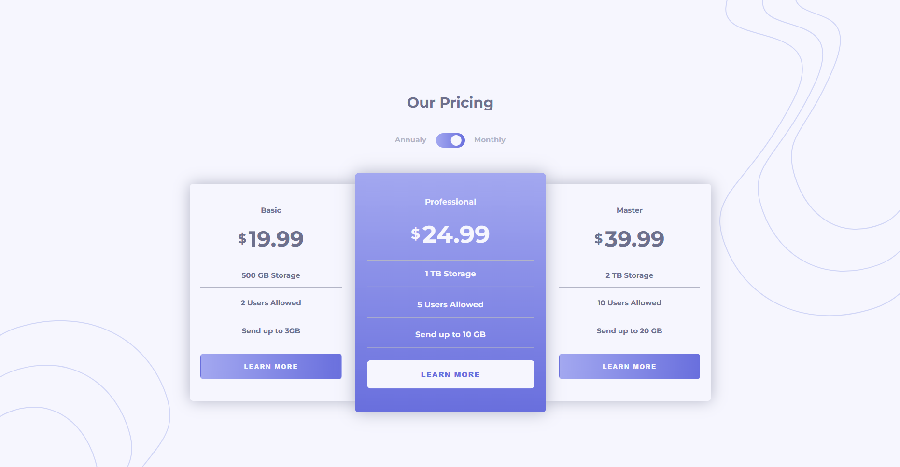

# Frontend Mentor - Pricing component with toggle solution

This is a solution to the [Pricing component with toggle challenge on Frontend Mentor](https://www.frontendmentor.io/challenges/pricing-component-with-toggle-8vPwRMIC). Frontend Mentor challenges help you improve your coding skills by building realistic projects. 

## Table of contents

- [Overview](#overview)
  - [The challenge](#the-challenge)
  - [Screenshot](#screenshot)
  - [Links](#links)
- [My process](#my-process)
  - [Built with](#built-with)
  - [What I learned](#what-i-learned)
  - [Continued development](#continued-development)
- [Author](#author)

## Overview

### The challenge

Users should be able to:

- View the optimal layout for the component depending on their device's screen size
- Control the toggle with both their mouse/trackpad and their keyboard
- **Bonus**: Complete the challenge with just HTML and CSS (✅)

### Screenshot

### Links

- Solution URL: [Add solution URL here](https://your-solution-url.com)
- Live Site URL: [Click Here](sirbiel100.github.io/challenge--26/)

## My process

### Built with

- Semantic HTML5 markup
- Flexbox
- Mobile-first workflow
- [SASS](https://sass-lang.com/) - CSS Pre-processor

### Continued development

As a frontend developer I want to keep improving myself on frontend skills.

## Author

- Website - [Gabriel Crispim](https://gabriel-crispim-portfolio-git-main-sirbiel100.vercel.app/)
- Frontend Mentor - [@sirbiel100](https://www.frontendmentor.io/profile/sirbiel100)
- LinkedIn - [Gabriel Crispim](https://www.linkedin.com/in/gabrielrcrispim/)